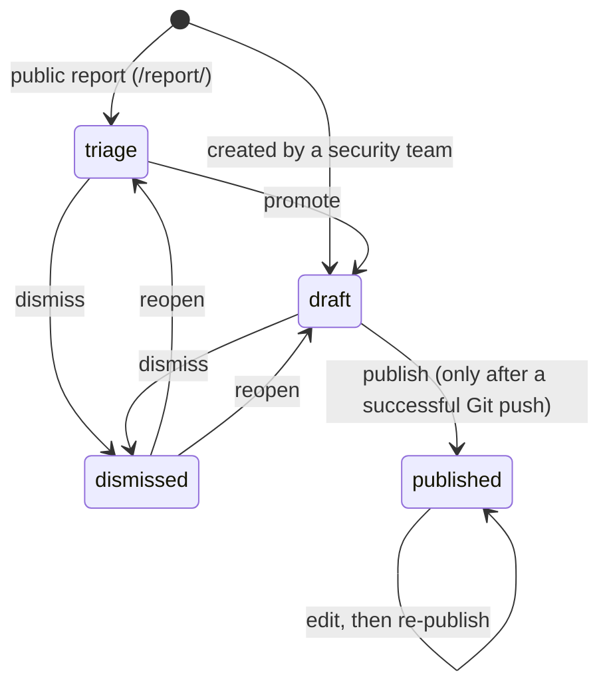

# AdvisoryHub User Manual

This is the **task-oriented** user manual for AdvisoryHub. It explains, in plain
"how do I…" terms, what you can do in the app and how to do it. There is a
separate guide for each kind of user, so you only have to read the one that
matches your role.

If you are a developer or want the authoritative rules behind a behaviour, read
the specifications in [`../specification/`](../specification/) instead — this
manual links to the relevant spec sections throughout. Where the manual and the
code ever disagree, the code (and the specs that track it) win.

---

## 1. What AdvisoryHub is

AdvisoryHub is the **private authoring system** for security advisories covering
Eclipse Foundation projects. Project security teams use it to triage incoming
reports, write and review advisories, request CVEs, and publish. Publishing
exports an advisory to standard **OSV** and **CSAF** JSON — plus a **CVE
record** when a CVE is assigned — and pushes them to a separate publication Git
repository; that repository's own pipeline renders the public advisory website.

There is **no public reading surface inside AdvisoryHub.** Everything here is
gated by login and per-advisory access — even a *published* advisory is visible
inside AdvisoryHub only to the people who could already see it. The public reads
published advisories on the separate website, not here.

---

## 2. Which guide should I read?

| If you… | Read |
|---|---|
| Want to report a suspected vulnerability in an Eclipse project | [Reporter's Guide](./reporter.md) |
| Were given access (or an email invitation) to a specific advisory, but you are not on the project's security team | [Collaborator & Viewer Guide](./collaborator-and-viewer.md) |
| Are on a project's security team and author/triage/publish that project's advisories | [Security-Team Guide](./security-team.md) |
| Are a global administrator — you review advisories, manage CVEs, oversee publication, and run the Admin Console | [Administrator & Reviewer Guide](./administrator.md) |

> **Installing or running the service itself** is a different job — see the
> [operations manual](../operations/) for installation, configuration, and deployment.

Roles can overlap (an administrator is also an owner everywhere; a security-team
member can also be invited to another team's advisory). Read the guide for your
*main* job and follow the cross-links when you act in another capacity.

A note on two roles that have **no guide of their own**:

- **Shadow / roster members** — if you are on a project's Eclipse security team
  but have never signed in, the system may already email you about your
  project's advisories. You cannot act on anything until you sign in; doing so
  turns your shadow record into a full security-team account (see the
  [Security-Team Guide](./security-team.md#1-who-this-guide-is-for)).
- **Background workers** — publication, notification, and sync jobs run as
  automated workers. They are not users and have no manual.

---

## 3. Signing in

AdvisoryHub has **no local password.** You sign in through the Eclipse
Foundation identity provider (OIDC):

1. Visit the site root (`/`). Anonymous visitors see a small landing page with a
   **Sign in** button and a link to report a vulnerability.
2. Click **Sign in** and complete the identity-provider login.
3. On success you land on your advisory list (`/advisories/`) — your working
   surface.

Your account is created automatically on first login, and your **group
memberships are mirrored from the identity provider every time you sign in**
([INV-OIDC-1]). This is how the app knows whether you are a security-team
member, an administrator, or neither. You cannot edit groups inside AdvisoryHub;
membership changes are made in the identity provider and take effect at your
next login.

> **What you can see.** After signing in you only see advisories you have been
> granted access to, or advisories belonging to a project whose security team
> you are on. A brand-new account with no grants sees an empty list — that is
> expected, not a bug.

The **account menu** (top right) is where your personal pages live: **Settings**
(`/accounts/me/` — your email, display name, groups, and whether you are an
administrator), **Notification settings**, and **Sign out**.

**Signing out** ends your session; you land on a signed-out confirmation page.

> **Local development.** The docker-compose dev stack seeds a demo login —
> `alice@example.org` / `correcthorsebatterystaple` — backed by the bundled
> Kanidm identity provider. This applies to local dev only; production uses the
> real Eclipse identity provider.

---

## 4. The advisory lifecycle at a glance

Every advisory is in exactly one of **four states**. You will see these words
throughout the app and in every guide.

| State | Meaning |
|---|---|
| **triage** | An untrusted incoming report, not yet accepted. Awaits promotion to draft or dismissal. |
| **draft** | An advisory the security team is actively writing, reviewing, and preparing. |
| **published** | Exported to OSV/CSAF and live in the publication repository. |
| **dismissed** | Closed without publishing (duplicate, not a vulnerability, out of scope). Reversible. |

Three independent **sub-machines** ride alongside the state and are explained in
the role guides where they apply:

- **Review** — `none → submitted → approved` or `changes requested`. A draft is
  often reviewed before publishing.
- **CVE request** — an internal queue: `requested → reserved` or `rejected`.
- **Publication** — each publish attempt is a task: `queued → running →
  succeeded` or `failed`.

The full transition tables and a sequence diagram are in
[`advisory-lifecycle.md`](../specification/advisory-lifecycle.md).

---

## 5. Roles and what they can do

Authorization uses **three roles**, ranked `owner > collaborator > viewer`, plus
the **global administrator** who is effectively owner everywhere and the only
reviewer:

| Role | How you get it | In short |
|---|---|---|
| **viewer** | Granted on a specific advisory, or auto-granted on a report you filed while signed in | Read the advisory and its history; post public comments. |
| **collaborator** | Granted on a specific advisory | Everything a viewer can, plus edit content and use internal comments. |
| **owner** | Be on the advisory's project security team (not grantable) | Full control of that project's advisories: edit, manage access, request CVEs, submit for review, publish, dismiss. |
| **global administrator** | Member of the admin group in the identity provider | Owner on *every* advisory, plus the exclusive reviewer and the Admin Console. |

`owner` is **structural, never handed out** — it comes only from security-team
or administrator membership, so no one can grant themselves more power
([INV-AUTH-3]). The complete capability matrix, including how it changes per
state, is in [`permissions.md`](../specification/permissions.md).

---

## 6. Common building blocks

These appear in more than one guide; each guide explains them from its own
perspective, but here is the shared vocabulary.

- **Comments — public vs internal.** Public comments are visible to everyone who
  can see the advisory; internal comments are visible to collaborators, owners,
  and administrators only. Whether a comment is internal is fixed when it is
  posted. You can `@`-mention a person or a whole `@team`.
- **Version history.** Editing an advisory's content appends a new, immutable
  version; nothing is overwritten. You can view the history and diff any two
  versions.
- **Notifications.** The app emails you about events on advisories you are
  involved with, and keeps an in-app notification inbox at
  `/notifications/inbox/`. Set your defaults at `/notifications/preferences/`;
  each advisory page also has a **Notifications** panel with per-advisory
  presets (follow your defaults, everything, important only, unsubscribe, or
  custom). "Only when mentioned" is the floor — mentions always notify, and
  there is no "never". Notification emails deliberately carry no advisory
  content: just the event, the advisory id, the project, and a footer
  explaining why you received it.
- **New / changed markers.** List pages (and the compact left-hand rail on
  every advisory page) mark advisories that are **new** or have **changed**
  since you last viewed them, so you can pick up where you left off.
- **Maintenance mode.** When an administrator turns maintenance mode on, a
  banner with their message appears and every write action is refused until it
  is over; reading keeps working.
- **Audit log.** Every governance action (create, edit, grant, publish, …) is
  recorded in an append-only audit log that administrators can review.

---

## 7. Glossary

| Term | Meaning |
|---|---|
| **Advisory** | A security advisory record, identified like `ECL-cf23-gh45-jm67` — three groups of four characters from a reduced, unambiguous alphabet. |
| **Triage** | The state for untrusted incoming reports, and the act of accepting or rejecting them. |
| **Draft / Published / Dismissed** | The other three lifecycle states (see §4). |
| **Security team** | A project's group of owners, mirrored from the Eclipse roster / identity provider. |
| **Owner / Collaborator / Viewer** | The three access roles (see §5). |
| **Global administrator / Reviewer** | Member of the admin group; owner everywhere and the only reviewer. |
| **Admin Console** | The administrator dashboard at `/admin/` (Inbox, Projects, Users, Groups, CVE Assignment, Publication, Audit logs, Access log, Maintenance). Distinct from Django admin at `/django-admin/`. |
| **Inbox** | The Admin Console's unified work queue. (Not to be confused with your personal notifications inbox.) |
| **CVE request** | A request, queued internally, for a CVE identifier to be reserved for an advisory. |
| **Review** | The approval step: an owner submits a draft and an administrator approves it or requests changes. |
| **Mature publisher** | A project flag that lets its team publish without a per-advisory approval. |
| **Publication** | Exporting an advisory to OSV + CSAF JSON (plus a CVE record when a CVE is assigned) and pushing it to the publication Git repository. |
| **OSV / CSAF** | The two standard JSON formats AdvisoryHub always publishes (Open Source Vulnerability and Common Security Advisory Framework). |
| **CVE record** | A third published artifact in the CVE JSON record format, generated alongside OSV/CSAF when the advisory has an assigned CVE. |
| **Possible duplicates** | An owner-only panel listing advisories similar to the one you're viewing, computed in the background (only on deployments that enable it). |
| **GHSA-linked** | An advisory whose content is synced from a GitHub Security Advisory and is read-only here. |
| **Orphan CVE** | A CVE that was assigned but then unassigned, which an administrator must reconcile at cve.org. |
| **Access grant / Invitation** | An explicit per-advisory permission for a user or group; an invitation is a grant pending the recipient's first login. |
| **Step-up authentication** | A forced recent re-login required before sensitive actions such as publishing. |
| **Audit log** | The append-only record of governance actions. |

---

## 8. The guides

- [Reporter's Guide](./reporter.md)
- [Collaborator & Viewer Guide](./collaborator-and-viewer.md)
- [Security-Team Guide](./security-team.md)
- [Administrator & Reviewer Guide](./administrator.md)
