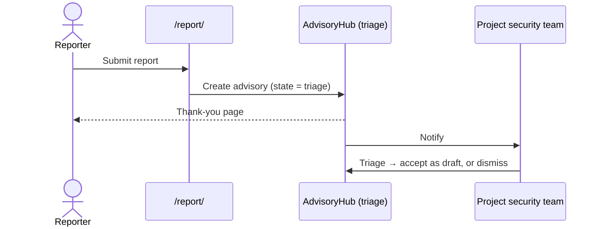

# Reporter's Guide

**Audience:** anyone who wants to report a suspected security vulnerability in
an Eclipse Foundation project. **You do not need an account** to file a report.

This is the shortest of the four guides on purpose — reporting is meant to be
quick. For shared concepts and the glossary, see the
[manual index](./README.md).

---

## 1. What you can (and can't) do

| You can | You cannot |
|---|---|
| Submit a vulnerability report through the public form | See other advisories or any private data |
| Optionally sign in first, so you can follow your own report afterwards | Edit, dismiss, publish, or request a CVE |
| Post comments on your own report (only if you were signed in) | Read internal team discussion |

Everything beyond filing a report is handled by the project's **security team**,
who will *triage* what you send (see §4).

---

## 2. Filing a report

Go to **`/report/`** (also linked from the AdvisoryHub landing page as "report a
vulnerability"). Fill in the form:

1. **Project** — start typing the project's name or PMI id (for example
   `technology.jetty`) and pick it from the list. If you genuinely don't know
   which project is affected, choose the **"I don't know"** option; your report
   is routed to administrators, who will assign it to the right project.
2. **Summary** — a single-sentence description of the issue (up to 300
   characters).
3. **Details** — the full write-up: what the vulnerability is, how to reproduce
   it, affected versions, and any proof of concept. **Markdown is supported**,
   and you have plenty of room (up to ~16,000 characters).
4. **Preferred name for recognition (optional)** — shown only when you are *not*
   signed in; used solely to credit you on the resulting advisory. It is **not**
   used to contact you. (Signed-in reporters are credited through their account
   instead — see §5.)

Below these sits a collapsed, entirely optional **Advanced** section — aliases,
CWE ids, affected packages, severity, references, credits — mirroring the
structured fields of a full advisory. Fill in only what you are confident
about; the security team refines these during triage.

Then submit. Beyond that there are deliberately no other fields — in
particular, nothing that asks for contact details.

> **Reporting privately.** AdvisoryHub never asks for your email or a PGP key on
> this form. If you report **anonymously**, there is no way for the team to reply
> to you directly, and **you cannot reclaim or track the report later** — even if
> you sign in afterwards with the same email ([INV-INTAKE-2](../specification/invariant.md#inv-intake-2)). If you want to be
> reachable and able to follow progress, sign in *before* submitting (see §5).

> **Spam protection.** The form has invisible anti-abuse measures and submission
> rate limits ([INV-INTAKE-1](../specification/invariant.md#inv-intake-1)), and some deployments add a visible CAPTCHA.
> Ordinary reporters rarely notice any of it; you don't need to do anything
> special.

---

## 3. After you submit

You are taken to a **thank-you page** confirming your report was received. Behind
the scenes:

- A new advisory is created in the **triage** state — *untrusted* until the team
  accepts it.
- The project's security team is notified.

From here the team will either **accept** your report as a working draft (and
eventually, perhaps, publish an advisory) or **dismiss** it (for example, if it
turns out to be a duplicate or not a security issue). What happens next, and how
the resulting advisory is written and published, is covered in the
[Security-Team Guide](./security-team.md).

---

## 4. What "triage" means

"Triage" is both the *state* your report starts in and the *act* of the security
team deciding what to do with it. While in triage, your report is treated as
unverified: it is visible only to the project's owners and administrators (and to
you, if you were signed in). It cannot be published until the team promotes it to
a draft and prepares it properly. See the lifecycle overview in the
[manual index](./README.md#4-the-advisory-lifecycle-at-a-glance).

---

## 5. Reporting while signed in

If you sign in (see [Signing in](./README.md#3-signing-in)) **before** you
submit, two things change:

- Your verified email from the identity provider becomes the report's reporter
  contact — so the team can reach you.
- You are automatically granted **viewer** access to the advisory you filed
  ([INV-INTAKE-3](../specification/invariant.md#inv-intake-3)). That means you can:
  - find it later in your advisory list at `/advisories/`, and
  - read it and post **comments** on it (for example, to answer the
    team's follow-up questions).

Comments are never published or disclosed externally; at most they are visible
to people with access to the advisory inside AdvisoryHub. You still cannot edit
it, see internal team comments, or take any team action — viewer is
read-and-comment only (you cannot post internal comments). If you later need
fuller involvement, an owner can grant you collaborator access; see the
[Collaborator & Viewer Guide](./collaborator-and-viewer.md).

---

## Related guides

- [Manual index](./README.md) — concepts, lifecycle, glossary.
- [Collaborator & Viewer Guide](./collaborator-and-viewer.md) — if you are given
  access to follow or help with a specific advisory.
- [Security-Team Guide](./security-team.md) — what the team does with your report.
