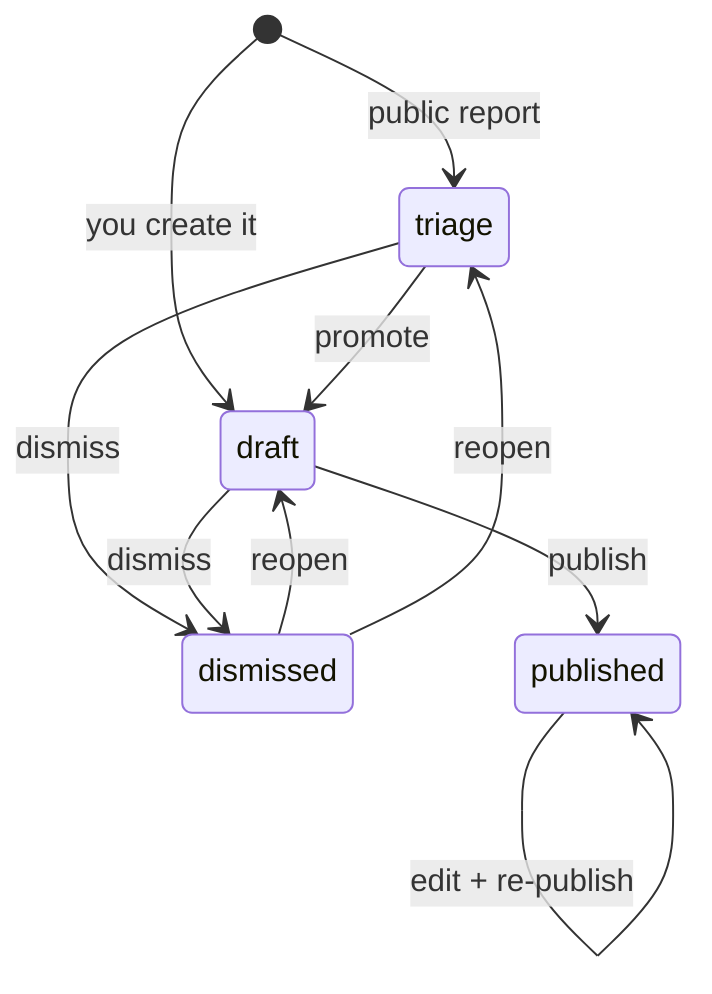
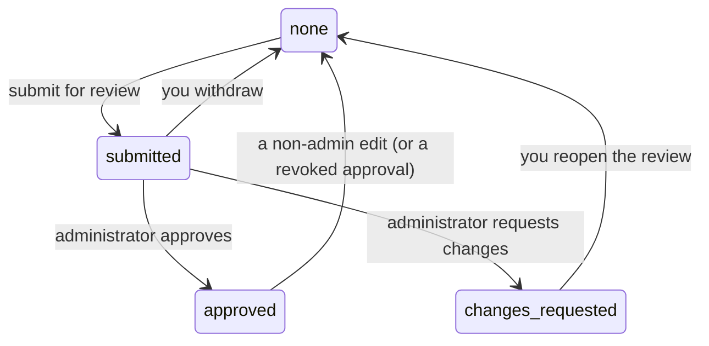
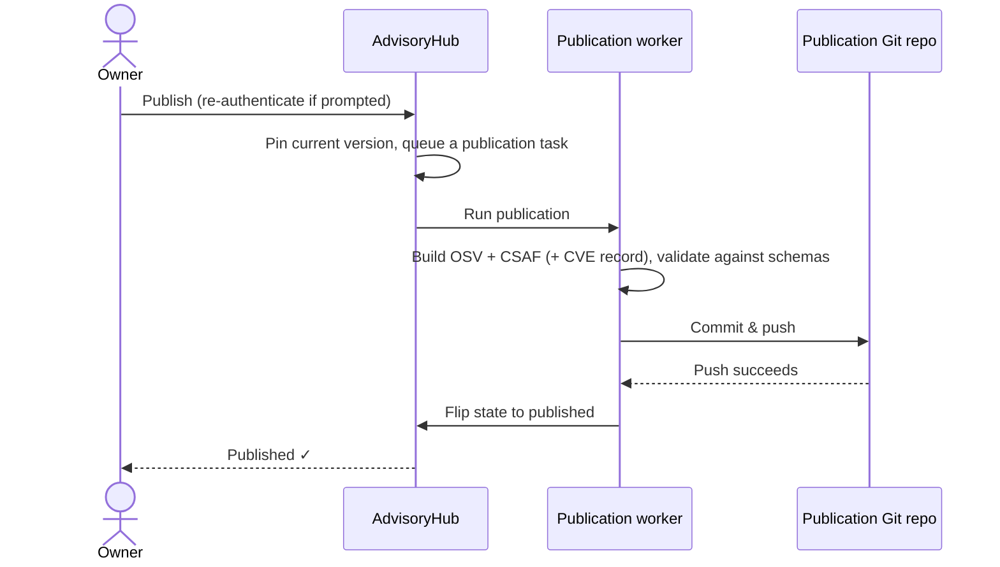

# Security-Team Guide

**Audience:** members of a project's security team. You are an **owner** of every
advisory belonging to your project — the role that does the real work of triaging
reports, writing advisories, getting them reviewed, requesting CVEs, and
publishing.

This is the most complete guide because owners touch the whole lifecycle. For
shared concepts (signing in, roles, the glossary), see the
[manual index](./README.md). For what happens on the reviewer/CVE/administrator
side, follow the cross-links to the
[Administrator & Reviewer Guide](./administrator.md).

---

## 1. Who this guide is for

You become an owner by being a member of your project's **security team** group.
That membership lives in the Eclipse Foundation identity provider and is mirrored
into AdvisoryHub every time you sign in ([INV-OIDC-1](../specification/invariant.md#inv-oidc-1)) — there is no "add me as
owner" button, and owner access is never granted by hand ([INV-AUTH-3](../specification/invariant.md#inv-auth-3)). When
your project's roster changes, the change takes effect at the affected person's
next login.

> **Notifications before your first login.** If you are on a project's Eclipse
> security team, AdvisoryHub may email you about that project's advisories *before*
> you have ever signed in, so team mentions and alerts reach you. Until you sign
> in you cannot act on anything; your first sign-in turns that notification-only
> "shadow" record into a full security-team account ([INV-OIDC-5](../specification/invariant.md#inv-oidc-5)).

As an owner you can do everything in the capability matrix's owner column; the
authoritative, state-by-state version is in
[`permissions.md`](../specification/permissions.md). A few high-privilege actions
are reserved for administrators and noted as such below (unassigning a CVE,
reviewing/approving, maintenance).

Your work surface is the advisory list at `/advisories/`: search with the `q`
box, switch the **state tabs** (All / triage / draft / published / dismissed),
sort the columns, and click into any advisory. Rows are marked **new** or
**changed** when something happened since your last visit, and every advisory
page keeps a compact left-hand rail of the advisories you can see, for quick
jumps.

---

## 2. Triaging incoming reports

Public reports for your project arrive in the **triage** state. Find them via the
**triage** tab on `/advisories/`. Open one and decide:

- **Accept as draft** (`…/promote/`) — treat the report as a genuine vulnerability
  worth working on. It becomes a normal draft you can edit, review, and publish.
- **Dismiss** (`…/dismiss/`) — reject it (duplicate, not a vulnerability, out of
  scope). You must give a reason. Dismissed reports are reversible later (§9).
- **Flag for admin routing** (`…/flag/`) — if the report clearly belongs to a
  *different* project, flag it with a note. It then moves to the administrators'
  queue for re-homing ([INV-INTAKE-4](../specification/invariant.md#inv-intake-4)): while flagged, the report is locked to
  administrators, who alone can promote it (choosing its real project) or
  dismiss it. If you flagged it by mistake, clear your own flag
  (`…/clear-routing-flag/`) to take the report back.

While an advisory is in triage, owners are the only people who can act on it; the
reporter (and any viewer) can read it and post comments but nothing more.

> **Possible duplicates.** On deployments that enable it, the advisory page
> shows owners a **Possible duplicates** panel: a background check compares the
> report against your project's existing advisories and lists up to five
> similar ones with a confidence score. It is a triage aid, not a verdict — use
> it to spot duplicates before promoting, and cite the original when you
> dismiss one. Collaborators and viewers never see this panel.

---

## 3. Creating an advisory

You don't have to start from a report — you can author directly. Open **New →
New advisory** in the top navigation (`/advisories/new/`; the menu appears only
for security-team members and administrators) and fill in:

**Basics**

- **Project** — must be a project whose security team you're on.
- **Summary** — one sentence (≤300 characters).
- **Details** — the full description; **Markdown is supported**.

**Structured sections** (each is a repeatable list; all optional, but the more
complete the better the published OSV/CSAF output):

| Section | What it captures |
|---|---|
| **Aliases** | Other identifiers for the same vulnerability (e.g. a `GHSA-…` or `CVE-…` id). |
| **CWE IDs** | Weakness classifications, entered as `CWE-NN`; validated against the known CWE catalogue. |
| **References** | URLs with a type — Advisory, Article, Fix, Report, Web, and so on. |
| **Severity** | A CVSS v3/v4/v2 vector string, or an Ubuntu qualitative rating. |
| **Affected** | Affected packages: name, **ecosystem** (Maven, npm, PyPI, …), optional purl, and version **ranges** with `introduced` / `fixed` (or `last affected`) events. |
| **Credits** | People/organisations to credit, each with a type (Finder, Reporter, Analyst, …). |

These mirror the [OSV schema](https://ossf.github.io/osv-schema/); the form
validates values as you go so they won't fail later at publish time. Saving
creates the advisory as a **draft** and records the first version.

---

## 4. Editing and version history

Open an advisory and choose **Edit** (`…/edit/`). Key behaviours:

- **Versions are append-only.** Every content change records a new version;
  earlier versions are never overwritten ([INV-VERSION-1](../specification/invariant.md#inv-version-1)). Review the history at
  `…/history/` and compare any two versions with the diff view
  (`…/versions/<n>/diff/`).
- **Editing a published advisory flags it for re-publication.** The public copy
  doesn't change until you re-publish (§8); the advisory shows a **Re-publish**
  action once it has unpublished edits.
- **Editing can reset an approval.** A content edit after an advisory was approved
  in review invalidates that approval — you'll need to resubmit (§7).
- **Changing the project.** Owners can move a *native* advisory to another
  project, but only to a project whose security team you're also on. (GHSA-linked
  advisories follow their source repository and are never moved by hand.) After
  a move the advisory shows a banner asking you to **review its access grants**
  — people invited in the old project's context may no longer belong; dismiss
  the banner once you've checked.

---

## 5. Managing who can see and help

Owners control per-advisory access from the **Access** panel
(`…/access/`). You can:

- **Grant** a user or a group **viewer** or **collaborator** access (see the
  [Collaborator & Viewer Guide](./collaborator-and-viewer.md) for what each can
  do).
- **Invite by email** someone who doesn't have an account yet. They receive a
  link, and the grant activates automatically on their first sign-in with that
  email (invitations expire after 14 days).
- **Revoke** any grant or pending invitation.

You **cannot** grant `owner` — that role comes only from security-team or
administrator membership, by design ([INV-AUTH-3](../specification/invariant.md#inv-auth-3)). Every grant, change, and
revocation is written to the audit log.

---

## 6. Requesting a CVE

If the advisory needs a CVE identifier, choose **Request CVE**
(`…/request-cve/`). This adds the advisory to the administrators' internal CVE
queue; an administrator then **reserves** a CVE (which attaches it to your
advisory) or **rejects** the request with a reason — see the
[Administrator & Reviewer Guide](./administrator.md#4-managing-cves).

You can request a CVE on a **draft or published** advisory — not in triage, not
dismissed — when it has **no open request already, no CVE already assigned, and
isn't barred from requesting** ([INV-CVE-1](../specification/invariant.md#inv-cve-1)). Once a CVE is assigned, only an
administrator can unassign it (that's a CNA-side action).

---

## 7. Review

Most advisories are reviewed before publishing. The review is a small machine
that rides alongside the draft:

1. **Submit for review** (`…/submit-review/`) — this snapshots ("pins") the
   current version and notifies the reviewers. While submitted, the content is
   locked (only administrators can edit it) and it cannot be published yet.
2. **An administrator decides** — they **approve** it or **request changes**.
   Administrators are the only reviewers, and they cannot review their own
   submissions ([INV-REVIEW-3](../specification/invariant.md#inv-review-3)).
3. **If changes are requested** — reopen the review (`…/reopen-review/`), edit,
   and submit again.
4. **Withdraw** (`…/withdraw-review/`) — you can pull back a submission you made
   if you decide it isn't ready.

---

## 8. Publishing

Publishing exports the advisory to **OSV** and **CSAF** JSON — plus a **CVE
record** when a CVE is assigned — and pushes them to the publication Git
repository, which renders the public site.

**Before you can publish**, both of these gates apply:

- **Approval gate.** You may publish only if **either** your project is marked a
  **mature publisher** (administrators set this per project) **or** the advisory's
  review is **approved** ([permissions.md §7](../specification/permissions.md)).
  Publishing is always blocked while a review is still *submitted* — it must be
  decided or withdrawn first.
- **Step-up authentication.** Publishing is sensitive, so you may be prompted to
  **re-authenticate** before it proceeds, even though you're already signed in
  ([permissions.md §8](../specification/permissions.md)).

To publish: open the advisory and choose **Publish** (`/publication/<id>/publish/`),
completing the re-auth prompt if asked.

A few things to expect:

- **The advisory becomes "published" only after the Git push succeeds**
  ([INV-LIFECYCLE-3](../specification/invariant.md#inv-lifecycle-3)). If anything fails (validation, network, the push), the
  state does **not** change and the attempt is recorded as **failed**.
- **Failures land back on the advisory page.** The sidebar's **Publication**
  card shows the latest run — its status, a secret-redacted error message, the
  generated artifacts, and a diff against the current content. Because the
  state didn't change, you can fix the cause and press **Publish** again
  yourself. Administrators also see every failed task fleet-wide on the Admin
  Console's Publication page (see the
  [Administrator & Reviewer Guide](./administrator.md#5-publication-oversight)).
- **Re-publishing.** After you edit a published advisory (or a CVE is assigned to
  it), it is marked as needing re-publication; choose **Re-publish** to push the
  update.

---

## 9. Dismissing and reopening

- **Dismiss** (`…/dismiss/`) — close an advisory without publishing, with a
  required reason. You can dismiss from triage or draft. An open CVE *request*
  is cancelled automatically when you dismiss (and restored if you reopen).
  **If a CVE is already assigned you cannot dismiss the advisory yourself** —
  pulling a reserved CVE is a CNA-side action, so ask an administrator: when
  *they* dismiss it, the CVE is automatically unassigned into their orphan-CVE
  queue. While dismissed, the content is read-only for every role (comments
  stay open).
- **Reopen** (`…/reopen/`) — bring a dismissed advisory back. It returns to
  whatever state it was in before (triage or draft), and the normal review and
  publish gates apply again from there ([INV-LIFECYCLE-4](../specification/invariant.md#inv-lifecycle-4)). A dismissed advisory
  stays viewable to its grantees the whole time.

---

## 10. GHSA-linked advisories

Some advisories are **linked to a GitHub Security Advisory (GHSA)**. Their content
is synced from GitHub and is **read-only** inside AdvisoryHub — you won't edit the
fields here. The advisory page shows a **Linked GitHub Security Advisory** panel
with the upstream id, repository, state, and last-sync time, plus a **Refresh
from GHSA** button to pull the latest on demand (when the GHSA integration is
enabled; wider project- and organisation-level syncs are administrator
operations). Because their project follows the source repository, GHSA-linked
advisories are never moved between projects by hand.

Three behaviours to expect:

- **A sync counts as an edit.** If a refresh brings changed content, it appends
  a version like any edit — invalidating an existing review approval and, on a
  published advisory, flagging it for re-publication.
- **Publishing follows upstream.** A GHSA-linked advisory can be published only
  once the GHSA itself is published on GitHub, and publishing re-fetches the
  upstream metadata first so the export is current.
- **CVEs flow back to GitHub.** When an administrator reserves a CVE for a
  GHSA-linked advisory, AdvisoryHub pushes the id to the GHSA; the panel shows
  the push status. If upstream already carries a *different* CVE id, the panel
  warns about the conflict and publication is blocked until an administrator
  reconciles it.

---

## 11. Comments and notifications

- **Comments.** The advisory page ends with the **Activity** timeline — comments
  merged chronologically with recorded actions — and the comment box lives
  there. As an owner you can post ordinary or **internal** comments and
  `@`-mention people or a whole `@team`. Whether a comment is internal is fixed
  when posted. Authors can edit their comments (history is kept) or **redact**
  them; redaction hides the text but leaves the entry visible in the timeline.
- **Notifications.** Watch the in-app inbox at `/notifications/inbox/` and tune
  delivery at `/notifications/preferences/` (with per-advisory overrides).

---

## Related guides

- [Manual index](./README.md) — concepts, lifecycle, glossary.
- [Administrator & Reviewer Guide](./administrator.md) — review decisions, CVE
  reservation, publication retries, and project settings (including the
  mature-publisher flag).
- [Collaborator & Viewer Guide](./collaborator-and-viewer.md) — what the people
  you grant access to can do.
