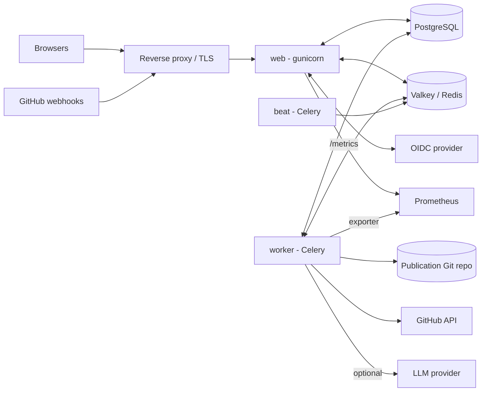

# AdvisoryHub Operations Manual

This manual is for the **operator** — the person who installs, configures, runs,
and maintains the AdvisoryHub *service*. It is the day-0-to-day-2 companion to the
end-user [`../manual/`](../manual/README.md) guides (which cover *using* the app) and to
[`../specification/architecture.md`](../specification/architecture.md) (which
explains *how it is built* and *why*). Where this manual and the code disagree,
the code wins; cross-references point you at the authoritative source.

It is **documentation only**: it tells you how to run AdvisoryHub with the tools
the repository already ships (`Dockerfile`, `docker-compose.yml`,
`gunicorn.conf.py`, the management commands). Production deployment is
platform-agnostic; for Kubernetes/OKD the repository ships a first-class
[Helm chart](./deploy-kubernetes.md), but nothing requires it.

---

## 1. What you are running

AdvisoryHub is a server-rendered Django application with an asynchronous task
tier. A complete deployment is **three application processes** plus **two
backing stores**, an **identity provider**, and one **external Git repository**:

| Component | What it is | Notes |
|---|---|---|
| **web** | Django served by gunicorn (`config.wsgi`) | Stateless; scale horizontally behind a TLS-terminating reverse proxy. |
| **worker** | Celery worker (`-A config`) | Runs publication, notifications, GHSA/PMI sync. |
| **beat** | Celery beat scheduler (`-A config`) | Fires the periodic tasks. Run **exactly one**. |
| **PostgreSQL** | Primary datastore (**required**) | Append-only audit triggers and JSONB queries are Postgres-specific — SQLite/MySQL are not supported. |
| **Valkey / Redis** | Celery broker + result backend + cache | Valkey is Redis-wire-compatible; `redis://` URLs work unchanged. |
| **OIDC provider** | Authentication + group membership | All identity flows from here; AdvisoryHub stores a mirror, never the authority. |
| **Publication Git repo** | External repo advisories are pushed to | Its own CI renders the public website. AdvisoryHub only writes to it. |

The full architecture, pipelines, and rationale are in
[`../specification/architecture.md`](../specification/architecture.md).

---

## 2. Prerequisites

- **Python 3.14** (pinned in `.python-version`) — for building the image / running
  management commands.
- **PostgreSQL** (the dev stack uses 16) — reachable via `DATABASE_URL`.
- **Valkey or Redis**, run with `--maxmemory-policy noeviction` so an eviction can
  never silently drop a broker message or a rate-limit/maintenance key.
- **An OIDC identity provider** (Kanidm, Keycloak, Okta, Entra, …) where you can
  register a confidential client and model the admin and per-project security-team
  **groups**.
- **A Git repository** for publication output, reachable over SSH or HTTPS, with a
  deploy key or token that can push.
- **An SMTP relay** for notification email (dev uses the console backend).
- A **TLS-terminating reverse proxy / load balancer** in front of `web`.
- *Optional:* a **GitHub App** (for the GHSA integration), **Eclipse API
  client credentials** (for security-team roster sync), and an **LLM provider**
  (Anthropic API key, or any OpenAI-compatible endpoint, for duplicate
  detection) — all off by default.

---

## 3. Which page do I need?

| Page | Covers |
|---|---|
| [installation.md](./installation.md) | Local evaluation (docker-compose), the **production first-run bootstrap** sequence, and the **container image**. |
| [configuration.md](./configuration.md) | The settings modules and the **complete environment-variable reference**. |
| [running-in-production.md](./running-in-production.md) | Running web/worker/beat, reverse proxy & TLS, static files, health probes, the beat schedule, and the security-hardening checklist. |
| [deploy-kubernetes.md](./deploy-kubernetes.md) | Deploying with the **Helm chart** (`charts/advisoryhub/`) on **OKD/OpenShift** or vanilla Kubernetes. |
| [integrations.md](./integrations.md) | Wiring the **OIDC provider**, the **publication Git repo** (SSH/token), the optional **GHSA GitHub App**, and **roster sync**. |
| [observability.md](./observability.md) | Logging, Prometheus metrics, the bundled Grafana/alert assets, and Sentry. |
| [maintenance.md](./maintenance.md) | Backups & data integrity, upgrades, maintenance mode, the management-command reference, and data retention / GDPR. |

For the in-app administrator role (reviewing advisories, the Admin Console),
see the end-user [Administrator & Reviewer Guide](../manual/administrator.md) —
that is a *different* "admin" from the system operator this manual addresses.
