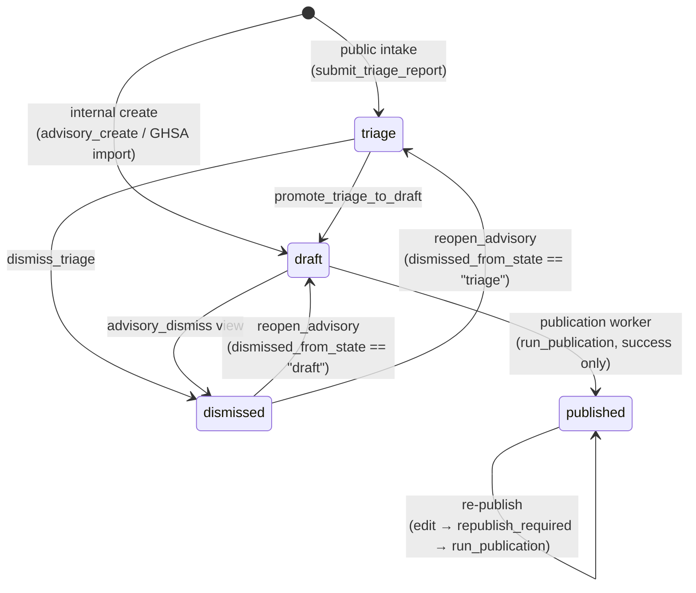
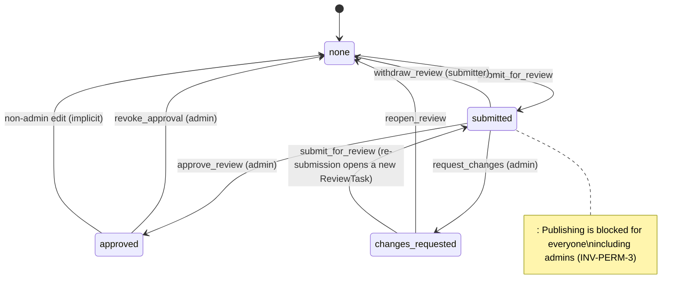
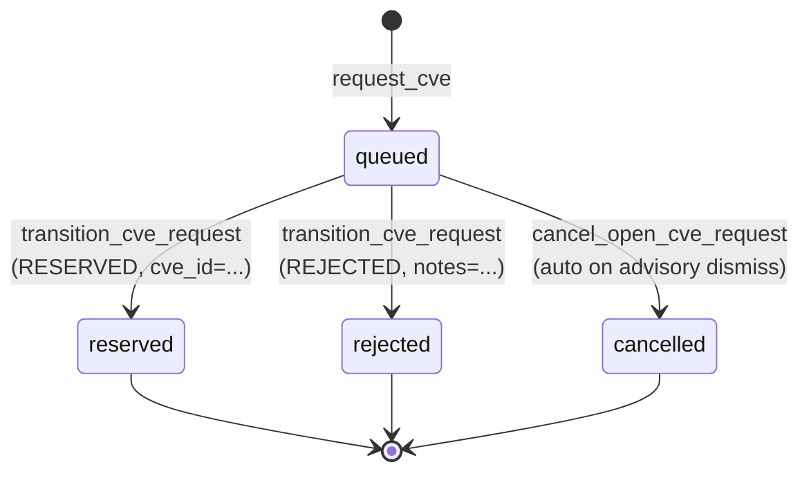
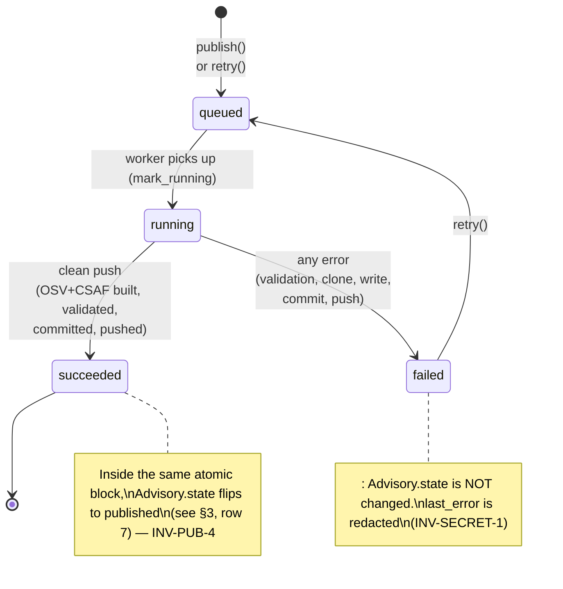

# Advisory Lifecycle

This document describes the lifecycle of an `Advisory` row in AdvisoryHub —
every state it can be in, every transition that can move it from one state to
another, who is allowed to trigger each transition, and what side-effects each
transition produces (audit entries, version rows, dependent task cancellations).

It is a companion to [`invariant.md`](./invariant.md) (the catalogue of
load-bearing rules) and [`permissions.md`](./permissions.md) (the
authorization model). Where a rule has a stable invariant ID, this document
references it by ID (`INV-XYZ-N`) rather than restating the reasoning. The
single source of truth for the executable transitions is the code in
`advisories/services.py`, `workflows/services.py`, `publication/services.py`,
and `publication/tasks.py`; this document tracks intent.

---

## 1. Scope

This page covers the **authoring** lifecycle inside AdvisoryHub: how an
advisory becomes a triage row, gets curated into a draft, is reviewed,
optionally has a CVE reserved against it, and is finally exported to the
publication Git repository. The static public website rendered from that
repository is **out of scope** — published state inside AdvisoryHub grants no
implicit access to anyone who is not already an owner or grantee
([INV-AUTH-7]).

The four lifecycle states are exhaustive and mutually exclusive
([INV-LIFECYCLE-1]).

---

## 2. Vocabulary

An advisory's "life" is described by **one** lifecycle state plus three
orthogonal status machines that ride alongside it:

| Machine | Field | Values | Diagram |
|---|---|---|---|
| Lifecycle | `Advisory.state` | `triage`, `draft`, `published`, `dismissed` | §3 |
| Review | `Advisory.review_status` | `none`, `submitted`, `changes_requested`, `approved` | §5 |
| CVE request | `workflows.CveRequestTask.status` | `queued`, `reserved`, `rejected`, `cancelled` | §6 |
| Publication | `publication.PublicationTask.status` | `queued`, `running`, `succeeded`, `failed` | §7 |

An advisory has exactly one lifecycle state, exactly one review status, at
most one *open* `CveRequestTask` ([INV-CVE-1]), and zero-or-more
`PublicationTask` rows (one per publish or re-publish attempt). The review
machine is logically attached to the advisory; the CVE and publication
machines are attached to task rows that pin a specific `AdvisoryVersion`
([INV-VERSION-2]).

The append-only edit log (`AdvisoryVersion`) is not a state machine — it
grows monotonically as content changes ([INV-VERSION-1], [INV-IMPL-5]) and
is referenced from §8.

---

## 3. High-level lifecycle



Notes on the diagram:

- `published` is reachable **only** via the publication worker's success
  branch, inside `select_for_update` and after a clean Git push
  ([INV-LIFECYCLE-3], [INV-PUB-4]).
- `dismissed` is **reversible** by owner or admin via
  `advisories.services.reopen_advisory` ([INV-LIFECYCLE-4]). The advisory
  returns to its pre-dismissal state recorded in
  `Advisory.dismissed_from_state` (`triage` or `draft`); the `dismissed_reason`
  and the audit trail stay as historical context. There is no
  `dismissed → published` shortcut — re-publishing requires going through the
  normal publication flow from the reopened state.
- The self-loop on `published` is logical, not a state change: edits append a
  new `AdvisoryVersion` and set `republish_required=True`, which makes the
  re-publish button surface; a successful re-publish writes a new commit on
  the same path but the `state` value does not change ([INV-REVIEW-4],
  [INV-VERSION-1]).
- There is no `published → draft` and no `published → dismissed` transition.
  Corrections always go through Edit + Re-publish.
- `triage` is created **only** by the public intake handler
  ([INV-LIFECYCLE-2]); no admin or API path produces it.

### 3.1 Lifecycle transitions table

The actor / precondition columns are the *minimum* requirements; admins
satisfy any "owner" requirement.

| # | From | To | Trigger (function) | Actor | Preconditions | Audit action(s) | Side effects |
|---|---|---|---|---|---|---|---|
| 1 | — | `triage` | `advisories.services.submit_triage_report` | Anonymous or authenticated reporter (public form) | Honeypot field empty ([INV-INTAKE-1]); rate-limit not tripped | `ADVISORY_TRIAGE_SUBMITTED` | `AdvisoryIntakeMetadata` created; `needs_admin_routing=True` if `project.slug == "unsorted"` ([INV-INTAKE-4]); viewer grant for authenticated reporter ([INV-INTAKE-3]); v1 seeded by post_save signal |
| 2 | — | `draft` | `advisories.views.advisory_create` | Owner (admin or project security team) | Caller can create for the chosen project | `ADVISORY_CREATED` | v1 seeded by post_save signal; `advisory_created` notification queued |
| 3 | — | `draft` | `ghsa.services.create_ghsa_linked_advisory` | Admin or project security team via a triggered GHSA sync; also the scheduled sync and webhook ingest (system) | GHSA ID not already mapped to another advisory ([INV-ID-2]) | `GHSA_LINKED_ADVISORY_CREATED` | `kind=GHSA_LINKED`; v1 seeded; initial `sync_single_ghsa` may append v2 if upstream returns content |
| 4 | `triage` | `draft` | `advisories.services.promote_triage_to_draft` | Owner (project security team or admin) | `can_triage(user, advisory)`; `needs_admin_routing=False` for non-admin actor ([INV-AUTH-6]); explicit `project` arg required when advisory is on `unsorted` | `ADVISORY_TRIAGE_PROMOTED`, `ADVISORY_STATE_CHANGED` | Same PK / public ID / `created_at` preserved ([INV-LIFECYCLE-5]); existing comments, audit entries, intake metadata, and the reporter's viewer grant survive intact; admin-routing flag cleared if set; a version row is appended when promotion reassigns the project (`project_slug` is payload-visible); `advisory_triage_promoted` notification queued |
| 5 | `triage` | `dismissed` | `advisories.services.dismiss_triage` | Owner (project security team or admin) | `can_triage(user, advisory)`; non-empty `reason` | `ADVISORY_DISMISSED`, `ADVISORY_STATE_CHANGED` (and, when `review_status != none` at dismiss time — rare for triage: `ADVISORY_REVIEW_WITHDRAWN`, conditionally `REVIEW_TASK_STATUS_CHANGED`) | `dismissed_reason` and `dismissed_from_state=triage` set; `cancel_pending_review` resets `review_status` to `none` and closes any open `ReviewTask` as `withdrawn`; `advisory_triage_dismissed` notification queued |
| 6 | `draft` | `dismissed` | `advisories.views.advisory_dismiss` | Owner | `can_dismiss(user, advisory)`: not yet `published`; advisory has no `assigned_cve_id` unless actor is admin (footnote ² of `permissions.md` §5) | `ADVISORY_DISMISSED` (plus, when applicable: `CVE_REQUEST_CANCELLED`, `CVE_UNASSIGNED`, `ADVISORY_REVIEW_WITHDRAWN`, `REVIEW_TASK_STATUS_CHANGED`) | `cancel_open_cve_request` runs (any open CVE request → `cancelled`); `unassign_cve` runs if a CVE was assigned (admin-only path, leaves an `OrphanCve` to be marked rejected at cve.org); `cancel_pending_review` runs (resets `review_status` to `none` and closes any open `ReviewTask` as `withdrawn`) |
| 7 | `draft` | `published` | `publication.tasks.run_publication` (success branch) | Celery worker, on behalf of the user who called `publication.services.publish` | `can_publish` was true at enqueue time; OSV+CSAF built and validated; Git clone, commit, and push succeeded; no other queued/running task ([INV-CONCURRENCY-1]) | `ADVISORY_PUBLISHED`, `PUBLICATION_OSV_GENERATED`, `PUBLICATION_CSAF_GENERATED`, `PUBLICATION_CVE_GENERATED` (when a CVE is assigned), `PUBLICATION_GIT_COMMIT`, `PUBLICATION_GIT_PUSH`, `PUBLICATION_EXPORT_COMPLETED` | `published_at` stamped if previously null; `republish_required=False`; `PublicationTask.status=SUCCEEDED` with `commit_sha`; one `PublicationArtifact` row per kind — `osv`, `csaf`, plus `cve` when the pinned payload carries an `assigned_cve_id` ([INV-VERSION-3]; architecture.md §4.2). The artifact rows and the build/commit/push audits land *outside* the final atomic block (artifacts before the push, the git audits right after it); the state flip, task success, and the `ADVISORY_PUBLISHED` / `PUBLICATION_EXPORT_COMPLETED` audits share one `transaction.atomic` block ([INV-PUB-4]) |
| 8 | `published` | `published` | `publication.services.publish` → `run_publication` again | Owner (publish-eligible — §7 of `permissions.md`) | Edit happened since last publish (`republish_required=True`) **or** explicit re-publish for any reason; review gate per §5 applies | Same set as row 7 | A new `PublicationTask` row pins the **latest** `AdvisoryVersion`; OSV/CSAF and the commit on the same Git path are regenerated; prior `PublicationArtifact` and version rows remain immutable |
| 9 | `dismissed` | `dismissed_from_state` (`draft` or `triage`) | `advisories.services.reopen_advisory` | Owner (project security team or admin) | `can_reopen(user, advisory)`: state is dismissed | `ADVISORY_REOPENED`, `ADVISORY_STATE_CHANGED` (and, depending on orphan/CVE state: `CVE_REASSIGNED_FROM_ORPHAN` *or* `ORPHAN_REASSIGNMENT_REQUESTED`; `CVE_REQUESTED` if a cancelled queued request is re-created) | `state` flips to `dismissed_from_state`; `dismissed_reason` / `dismissed_from_state` kept as historical metadata; auto-cancelled `CveRequestTask` re-created in `queued` if no other open task and target is `draft`; latest `OrphanCve` reattached directly (orphan → `REASSIGNED`) when `ORPHANED`, else an `OrphanCveReassignmentTask` is queued for admin (see §3.1.4) when `MARKED_REJECTED`; `advisory_reopened` notification queued |

#### 3.1.1 Notes on row 1 — triage creation

`submit_triage_report` is the only constructor for `state=triage`
([INV-LIFECYCLE-2]). It does the following in one transaction:

- creates the `Advisory(state=TRIAGE)` row;
- creates `AdvisoryIntakeMetadata` with the reporter user (if authenticated),
  the request IP, and the User-Agent;
- if `project.slug == UNSORTED_PROJECT_SLUG`, sets
  `needs_admin_routing=True` ([INV-INTAKE-4]);
- if the reporter is authenticated, issues an `AdvisoryAccessGrant(viewer)`
  to that user ([INV-INTAKE-3]);
- emits `ADVISORY_TRIAGE_SUBMITTED`;
- queues the `advisory_triage_submitted` notification on `transaction.on_commit`.

The public form has **no reporter-email field**: anonymous reporters cannot
be re-associated with the report later ([INV-INTAKE-2]).

#### 3.1.2 Notes on row 7 — the only path to `published`

The flip to `published` runs inside `publication/tasks.run_publication`,
inside `Advisory.objects.select_for_update`, **only on the success branch**.
If any step fails — schema validation, clone, file write, commit, or push —
the task is marked `failed` (row in §7 below), the advisory's state remains
exactly what it was, and the audit log records the failure
([INV-LIFECYCLE-3]). The Celery task is enqueued via
`transaction.on_commit` so a rolled-back caller transaction never leaves a
stray queued task ([INV-PUB-5]).

#### 3.1.3 Notes on row 6 — dismiss-from-draft auto-cancellations

When a draft is dismissed via the `advisory_dismiss` view, the same atomic
block runs `cancel_open_cve_request` (emitting `CVE_REQUEST_CANCELLED` if a
queued task existed) and, when an `assigned_cve_id` is present, calls
`unassign_cve` (emitting `CVE_UNASSIGNED` and producing an `OrphanCve` for
the admin team to mark rejected at cve.org). It also runs
`workflows.services.cancel_pending_review`, which resets
`review_status` to `none` and closes any `OPEN` `ReviewTask` as
`WITHDRAWN`. This last cleanup matters specifically because:

- A surviving `CHANGES_REQUESTED` would persist a stale review badge
  across the dismiss/reopen cycle without a live task to act on.
- A surviving `SUBMITTED` would leave a phantom `OPEN` `ReviewTask` on
  the admin queue during the dismissed phase and after any subsequent
  reopen.
- A surviving `APPROVED` is the security-relevant case: it would let
  the owner publish without re-review on the way back out via
  `reopen_advisory`, contradicting [INV-PERM-3] / [INV-LIFECYCLE-4].

Both dismiss paths additionally stamp `Advisory.dismissed_from_state`
with the prior state so that `reopen_advisory` (row 9) knows the
destination. `dismiss_triage` calls the same `cancel_pending_review`
helper for symmetry, even though triage advisories almost never carry a
non-`NONE` `review_status` in practice (`can_submit_for_review` blocks
non-`draft` state).

#### 3.1.4 Notes on row 9 — reopen side-effect restoration

`advisories.services.reopen_advisory` is the inverse entry point. The state
flip is **immediate** even when admin work is still pending — keeping the
owner unblocked is more important than waiting on an out-of-band cve.org
operation.

CVE-side restoration runs inside the same atomic block as the state flip:

1. **Cancelled queued CVE request** — when the latest `CveRequestTask` for
   the advisory is `CANCELLED` (the auto-cancel from dismiss), no other open
   request exists, no CVE is currently assigned, and the target state is
   `draft`, a fresh `CveRequestTask` is created in `QUEUED` via
   `workflows.services.request_cve`. Triage targets skip this — triage
   advisories don't carry CVE requests in the first place
   ([can_request_cve](permissions.md#5-capability-matrix)).
2. **Orphan CVE disposition** — the newest `OrphanCve` for the advisory is
   consulted:
   - `status == ORPHANED` → `workflows.services.reassign_orphan_cve` runs
     immediately, transitioning the orphan to `REASSIGNED` and writing the
     CVE id back to `Advisory.assigned_cve_id`. Audit:
     `CVE_REASSIGNED_FROM_ORPHAN`. If the direct reassignment conflicts
     (the CVE is now held by another advisory, or this advisory already
     holds one), an `OrphanCveReassignmentTask` is queued for admin
     resolution instead. Audit: `ORPHAN_REASSIGNMENT_REQUESTED`.
   - `status == MARKED_REJECTED` → an `OrphanCveReassignmentTask` is
     created in `QUEUED` and surfaces in the admin inbox at
     `/admin/cves/`. The advisory itself is back in `draft` / `triage` with
     no `assigned_cve_id`. Audit: `ORPHAN_REASSIGNMENT_REQUESTED`. Admin
     resolves the task with one of two outcomes:
     - `reassigned` — cve.org rejection was undone out-of-band; the orphan
       transitions to `REASSIGNED` and the CVE id is reattached. Audit:
       `CVE_REASSIGNED_FROM_ORPHAN` + `ORPHAN_REASSIGNMENT_RESOLVED`.
     - `replaced` — rejection couldn't be undone; admin enters a fresh
       `replacement_cve_id` on the resolution form. A new
       `CveRequestTask(status=RESERVED, cve_id=…)` is created, the
       advisory's `assigned_cve_id` is set, and the orphan stays
       `MARKED_REJECTED`. Audit: `CVE_TASK_STATUS_CHANGED` and
       `ORPHAN_REASSIGNMENT_RESOLVED`.
   - `status == REASSIGNED` (orphan was already reclaimed previously) → no
     op.
   - No orphan exists → no op.

The `advisory_reopened` notification is queued post-commit through the same
`send_advisory_triage_event_email` task already used by other lifecycle
events.

Reopen does **not** touch `review_status` or any `ReviewTask`: dismiss
(rows 5 and 6) already ran `cancel_pending_review`, so the reopened
advisory always re-enters the review pipeline from `review_status=NONE`
and the normal submit/approve/publish gates apply on the way back out.

---

## 4. What does **not** transition the lifecycle

These changes are intentionally listed because they look like state changes
but are not — they update other fields and may set the re-publication flag,
but `Advisory.state` itself is unchanged:

- Editing draft or published content ([INV-REVIEW-4]).
- Toggling `republish_required` (set by edits, cleared by a successful
  publication).
- Stamping `access_review_required_at` after a project change.
- Refreshing `ghsa_metadata_synced_at` on a heartbeat sync that returned no
  payload changes (see §8.4).
- Submitting for review / approving / requesting changes / withdrawing —
  these change `review_status`, not `state` ([INV-REVIEW-1]; §5).
- Opening or transitioning a `CveRequestTask` — touches a separate row, not
  the advisory's `state` (§6).
- Flagging / un-flagging an advisory for admin routing — toggles
  `AdvisoryIntakeMetadata.needs_admin_routing`, not `state` ([INV-AUTH-6]).
- Running a duplicate-detection check (`similarity` app) — enqueued on every
  advisory-creation path and re-runnable by owners; it reads the pinned
  `AdvisoryVersion` payload and writes only its own `SimilarityCheck` /
  `SimilarityCandidate` rows, never the advisory ([INV-SIM-4]).

Adding a new payload-visible field to `Advisory.to_payload()` is therefore a
load-bearing decision: the field will start being versioned automatically
([INV-VERSION-1]).

---

## 5. Review sub-machine (`Advisory.review_status`)

The review machine is orthogonal to the lifecycle ([INV-REVIEW-1]) and is
meaningful only while `state=draft`. Submission freezes the content under
review against a specific `AdvisoryVersion` via `workflows.ReviewTask.version`
([INV-REVIEW-2], [INV-VERSION-2]).



### 5.1 Review-status transitions

| From | To | Trigger | Actor | Preconditions | Audit action(s) | Notes |
|---|---|---|---|---|---|---|
| `none` | `submitted` | `workflows.services.submit_for_review` | Owner (security team) | `can_submit_for_review`: lifecycle `state=draft`, advisory not currently `submitted`; **admins cannot submit** ([INV-REVIEW-3]) | `ADVISORY_SUBMITTED_FOR_REVIEW` | Creates a `ReviewTask` pinned to the current latest `AdvisoryVersion` ([INV-REVIEW-2], [INV-VERSION-2]) |
| `submitted` | `approved` | `workflows.services.approve_review` | Admin (global reviewer) | `can_review(by)`; `ReviewTask.status=OPEN` | `ADVISORY_REVIEW_APPROVED`, `REVIEW_TASK_STATUS_CHANGED` | `ReviewTask.status=APPROVED` |
| `submitted` | `changes_requested` | `workflows.services.request_changes` | Admin | `can_review(by)`; `ReviewTask.status=OPEN` | `ADVISORY_REVIEW_CHANGES_REQUESTED`, `REVIEW_TASK_STATUS_CHANGED` | `ReviewTask.status=CHANGES_REQUESTED` |
| `submitted` | `none` | `workflows.services.withdraw_review` | Owner (submitter side) | Any non-admin owner (need not be the original submitter); admins cannot withdraw ([INV-REVIEW-3]) | `ADVISORY_REVIEW_WITHDRAWN`, `REVIEW_TASK_STATUS_CHANGED` | `ReviewTask.status=WITHDRAWN` |
| `changes_requested` | `none` | `workflows.services.reopen_review` | Owner or admin | `review_status=CHANGES_REQUESTED` | `ADVISORY_STATE_CHANGED` (review-status field) | Allows edits to be made before a new submission |
| `changes_requested` | `submitted` | `workflows.services.submit_for_review` | Owner (security team) | Same as the initial submission | `ADVISORY_SUBMITTED_FOR_REVIEW` | Opens a **new** `ReviewTask` pinned to the (possibly newer) latest version |
| `approved` | `none` | `workflows.services.revoke_approval` | Admin | `can_revoke_approval(by)`; `review_status=APPROVED` | `ADVISORY_REVIEW_APPROVAL_REVOKED` | Used when the admin wants to retract approval before publication |
| `approved` | `none` | implicit, via `advisories.views.advisory_edit` | Non-admin owner / collaborator editing payload | Edit is by a non-admin and `review_status` was `approved` ([INV-REVIEW-4]) | `ADVISORY_REVIEW_APPROVAL_INVALIDATED` | Triggered by the edit itself; admins editing keep the approval (they could re-approve anyway) |

### 5.2 Interaction with publishing

- `review_status=submitted` blocks `Publish` for **everyone**, including
  global admins ([INV-PERM-3]). The pending review must be decided
  (approved or changes requested) or withdrawn first.
- For projects with `is_mature_publisher=False`, the project's security
  team may only publish when `review_status=approved` (or hand it to an
  admin who can). For `is_mature_publisher=True` projects, the security
  team may publish drafts without a top-level review ([INV-PERM-1],
  [INV-PERM-2]).

---

## 6. CVE-request sub-machine (`workflows.CveRequestTask.status`)

A `CveRequestTask` represents a request to the top-level security team to
reserve a CVE for the advisory. At most one task with `status=queued` exists
per advisory at any time, enforced by a DB unique constraint
([INV-CVE-1]).



### 6.1 CVE-request transitions

| From | To | Trigger | Actor | Preconditions | Audit action(s) | Notes |
|---|---|---|---|---|---|---|
| — | `queued` | `workflows.services.request_cve` | Owner (security team) on a draft or published advisory | `can_request_cve`: lifecycle is `draft` or `published` (blocked in `triage` and `dismissed`), no `assigned_cve_id` ([INV-CVE-2]), no other open task ([INV-CVE-1]), `cve_requests_banned=False` ([INV-CVE-3]) | `CVE_REQUESTED` | — |
| `queued` | `reserved` | `workflows.services.transition_cve_request(..., new_status=RESERVED, cve_id=...)` | Admin (CNA-side reviewer) | `can_review(by)`; valid `CVE-YYYY-NNNN…` format ([INV-ID-3]) | `CVE_TASK_STATUS_CHANGED` | Sets `Advisory.assigned_cve_id`; if the advisory is already `published`, also sets `republish_required=True`; for GHSA-linked advisories, additionally enqueues the EF-CVE push to GitHub (architecture.md §5.4) |
| `queued` | `rejected` | `workflows.services.transition_cve_request(..., new_status=REJECTED, notes=...)` | Admin | `can_review(by)`; non-empty `notes` | `CVE_TASK_STATUS_CHANGED`, optional `CVE_REQUEST_BANNED` | Posts a comment to the advisory; admin may also flip `cve_requests_banned=True` ([INV-CVE-3]) |
| `queued` | `cancelled` | `workflows.services.cancel_open_cve_request` | System (called from the dismiss-from-draft flow) | Advisory is being dismissed | `CVE_REQUEST_CANCELLED` | Not user-callable; runs inside the dismissal atomic block |

After `reserved` / `rejected` / `cancelled`, the task is terminal — a new
request opens a fresh `CveRequestTask` row only if the constraint in row 1
still permits it (`assigned_cve_id` empty, no ban, no open task).

### 6.2 Related cleanup paths

- `workflows.services.unassign_cve` (admin-only) clears
  `Advisory.assigned_cve_id` and creates an `OrphanCve` row that admins are
  expected to mark rejected at cve.org. Emits `CVE_UNASSIGNED`.
- `workflows.services.mark_orphan_rejected` flips the orphan row to
  `marked_rejected`. Emits `CVE_MARKED_REJECTED_AT_CVE_ORG`.

---

## 7. Publication-task sub-machine (`publication.PublicationTask.status`)

Each call to `publication.services.publish` (or `retry`) creates one
`PublicationTask` pinned to the **latest** existing `AdvisoryVersion` at
enqueue time ([INV-VERSION-2]). The Celery worker
(`publication.tasks.run_publication`) drives it through the states below.



### 7.1 Publication-task transitions

| From | To | Trigger | Actor | Preconditions | Audit action(s) | Side effects |
|---|---|---|---|---|---|---|
| — | `queued` | `publication.services.publish` | Owner (publish-eligible per §5.2) | `can_publish(by)`; lifecycle `state` ≠ `dismissed`; no other queued/running task ([INV-CONCURRENCY-1]); GHSA-linked advisories refresh metadata from GitHub first | `PUBLICATION_EXPORT_STARTED` | New `PublicationTask` row pins the latest `AdvisoryVersion`; Celery `run_publication` enqueued via `transaction.on_commit` ([INV-PUB-5]) |
| `queued` | `running` | `publication.services.mark_running` (called from `run_publication`) | Celery worker | Task picked up | — | `attempts` incremented |
| `running` | `succeeded` | `publication.tasks.run_publication` (happy path) | Celery worker | OSV+CSAF built from `task.version.payload` ([INV-VERSION-3]), validated against vendored schemas ([INV-PUB-6]), committed to a fresh `TemporaryDirectory` clone ([INV-PUB-1], [INV-PUB-3]), and pushed ([INV-LIFECYCLE-3]) | `PUBLICATION_OSV_GENERATED`, `PUBLICATION_CSAF_GENERATED`, `PUBLICATION_GIT_COMMIT`, `PUBLICATION_GIT_PUSH`, `PUBLICATION_EXPORT_COMPLETED`, `ADVISORY_PUBLISHED` | Inside the same `transaction.atomic` ([INV-PUB-4]): `Advisory.state=published`, `published_at` stamped (if null), `republish_required=False`, `commit_sha` recorded on the task |
| `running` | `failed` | `publication.tasks.run_publication` (exception branch) | Celery worker | Any of the steps above raised | `PUBLICATION_EXPORT_FAILED` (validation / unexpected) or `PUBLICATION_GIT_PUSH_FAILED` (any git-layer failure: clone, write, commit, or push) | `task.last_error` set to the redacted error string ([INV-SECRET-1]); `Advisory.state` unchanged; surface appears in the Admin Console's Publication page; the failure e-mail announces the event only and embeds no error text ([INV-SECRET-3]) — the redacted `last_error` is visible in the Admin Console |
| `failed` | `queued` | `publication.services.retry` | Owner (publish-eligible) | `task.status=failed`; `can_publish(by)` true now | `PUBLICATION_EXPORT_STARTED` (on the new task row) | Re-pins the **current** latest `AdvisoryVersion` — so a retry after additional edits picks up the new content |

The `succeeded` and `failed` states are terminal for the individual task
row; a retry creates a new row rather than reanimating the old one. Because
each successful publish writes the same deterministic file paths
(`PUB_OSV_PATH_TEMPLATE` / `PUB_CSAF_PATH_TEMPLATE`), a re-publish appears
in the publication repo as a new commit on those same paths — earlier
artifacts and earlier `AdvisoryVersion` rows are preserved on this side
([INV-IMPL-5]).

---

## 8. Publication sequence diagram

The diagram below shows one publish attempt end-to-end. The same flow drives
re-publishes; the only difference is that the pinned `AdvisoryVersion` is
v(n+1) instead of v1.

```mermaid
sequenceDiagram
    autonumber
    actor Owner
    participant View as publication.views<br/>(Publish button)
    participant Svc as publication.services.publish
    participant DB as Advisory + PublicationTask<br/>(Postgres)
    participant Q as Celery queue
    participant Worker as publication.tasks.run_publication
    participant Git as Publication Git repo

    Owner->>View: POST /advisories/:id/publish
    View->>View: can_publish(user, advisory)<br/>+ step-up auth (§8 permissions.md)
    View->>Svc: publish(advisory, by=user)
    Svc->>DB: SELECT … FOR UPDATE (advisory)
    Svc->>DB: pin latest AdvisoryVersion;<br/>create PublicationTask(status=queued)
    Svc->>Svc: transaction.on_commit(enqueue)
    Svc-->>View: PublicationTask
    View-->>Owner: redirect + "publication queued"

    Note over Svc,Q: On commit only (INV-PUB-5)
    Svc->>Q: run_publication.delay(task_id)

    Q->>Worker: dequeue
    Worker->>DB: mark_running(task)
    Worker->>Worker: build OSV (from task.version.payload)<br/>build CSAF (+ CVE record when assigned)<br/>validate against schemas (INV-PUB-6)
    Worker->>DB: PublicationArtifact rows (OSV, CSAF, + CVE when assigned)
    Worker->>Git: shallow clone into TemporaryDirectory (INV-PUB-1, INV-PUB-3)
    Worker->>Git: write files, commit, push

    alt All steps succeed
        Worker->>DB: BEGIN ATOMIC
        Worker->>DB: SELECT advisory … FOR UPDATE
        Worker->>DB: state=published, published_at set,<br/>republish_required=False
        Worker->>DB: PublicationTask.status=succeeded, commit_sha
        Worker->>DB: audit: ADVISORY_PUBLISHED, PUBLICATION_GIT_PUSH,<br/>PUBLICATION_EXPORT_COMPLETED, …
        Worker->>DB: COMMIT (INV-PUB-4)
        Worker->>Q: notification: advisory_published
    else Any step fails
        Worker->>DB: mark_failed(task, error=redact(error))
        Worker->>DB: audit: PUBLICATION_EXPORT_FAILED<br/>or PUBLICATION_GIT_PUSH_FAILED
        Note over Worker,DB: Advisory.state unchanged<br/>(INV-LIFECYCLE-3)
        Worker->>Q: notification: publication failure (event-only body, no error text — INV-SECRET-3)
    end
```

Key properties enforced by the diagram order:

- The Celery enqueue happens **only on commit** of the calling transaction
  ([INV-PUB-5]). A rolled-back caller never produces a queued task.
- The Git push happens **before** any state mutation on `Advisory`
  ([INV-LIFECYCLE-3]). A push failure leaves the advisory in its prior
  state.
- The state flip, task finalisation, `published_at`, and the audit emissions
  are inside one `transaction.atomic` block guarded by `select_for_update`
  ([INV-PUB-4], [INV-CONCURRENCY-2]).
- The clone uses a fresh `TemporaryDirectory` per attempt ([INV-PUB-1]) and
  is shallow ([INV-PUB-3]).
- Any error string that may carry a token has been through
  `_redact` / `redact_secrets` before reaching the task row, the audit
  metadata, or the e-mail body ([INV-SECRET-1], [INV-SECRET-3]).

---

## 9. Edit side-effects

Editing an advisory never changes `state` directly. It does, however, ripple
into the orthogonal machines and the version log:

| Edit scenario | `AdvisoryVersion` | `review_status` | `republish_required` | Other |
|---|---|---|---|---|
| First payload-visible edit on a draft (any editor) | new row appended via `record_advisory_version` ([INV-VERSION-1]) | unchanged | unchanged | `ADVISORY_EDITED` audit |
| Edit on a draft with `review_status=approved`, by a **non-admin** | new row appended | reset to `none`, audit `ADVISORY_REVIEW_APPROVAL_INVALIDATED` ([INV-REVIEW-4]) | unchanged | — |
| Edit on a draft with `review_status=approved`, by an admin | new row appended | unchanged | unchanged | Admin can re-approve at will |
| Edit on a `published` advisory | new row appended | reset to `none` for non-admin if it was `approved` | set to `True` (re-publish required) | The Publish button becomes "Re-publish" in the UI |
| Project change (native advisory, human editor) | new row appended (project is payload-visible) | reset to `none` if `approved` and editor is non-admin | set to `True` if `published` | `access_review_required_at` stamped — surfaces the access-review banner; `ADVISORY_PROJECT_CHANGED` audit; `advisory_created` notification queued for the new project's team |
| PMI re-home of a GHSA-linked advisory (system, [INV-GHSA-1]) | new row appended (`project_slug` is payload-visible) | **unchanged** — approval is preserved | set to `True` if `published` | `access_review_required_at` stamped; `ADVISORY_PROJECT_CHANGED` audit with `reason=pmi_repo_reassignment`; `advisory_created` notification queued for the new project's team |
| Non-payload save (state-only flip, heartbeat sync, `republish_required` toggle, `access_review_required_at` stamp) | **no row** ([INV-VERSION-1]) | unchanged | depends on the field | — |
| GHSA heartbeat sync that returned no payload changes | **no row** | unchanged | unchanged | `ghsa_metadata_synced_at` refreshed |
| GHSA sync that returned changed fields (`result.changed_field_names` non-empty) | new row appended | reset to `none` if `approved`, audit `ADVISORY_REVIEW_APPROVAL_INVALIDATED` — no admin carve-out: the content author is upstream GHSA, not whoever pressed Sync ([INV-REVIEW-4]) | set to `True` if `published` | `GHSA_METADATA_FETCHED` audit |

The two key invariants in this table:

- `AdvisoryVersion` rows are append-only ([INV-IMPL-5]); workflow tasks
  `PROTECT`-FK into them, so a version ever pinned by a `ReviewTask` or
  `PublicationTask` cannot be removed even from raw ORM
  ([INV-VERSION-2]).
- Adding a new field to `Advisory.to_payload()` automatically pulls it into
  the versioning machinery — versions, reviews, and publications all start
  tracking the new field on the next edit ([INV-VERSION-1]).

---

## 10. Triage-specific behaviour

Triage rows ride alongside the lifecycle as a distinct, owner-only mini-state
because they originate from an **untrusted** public form
([INV-AUTH-5]). The transitions in §3 cover the lifecycle exits
(`promote_triage_to_draft`, `dismiss_triage`); two further sub-transitions
mutate intake metadata without changing `state`:

| Trigger | Actor | Preconditions | Audit action | Effect |
|---|---|---|---|---|
| `advisories.services.flag_for_admin_routing` | Owner (project security team) | Lifecycle `state=triage`; not already flagged; advisory not on the `unsorted` sentinel project; non-empty note | `ADVISORY_FLAGGED_FOR_ROUTING` | Sets `AdvisoryIntakeMetadata.needs_admin_routing=True`; advisory becomes admin-only for edit / triage decisions ([INV-AUTH-6]); `advisory_flagged_for_routing` notification queued |
| `advisories.services.clear_admin_routing_flag` | Owner (project security team or admin) — the flagging team may retract its own handoff ([INV-AUTH-6]) | Lifecycle `state=triage`; currently flagged | `ADVISORY_ROUTING_FLAG_CLEARED` | Sets `needs_admin_routing=False`; project owners regain triage capability; `advisory_routing_flag_cleared` notification queued |
| `advisories.services.reassign_triage_project` | Admin, or an owner of the advisory who is also on the destination project's security team | Lifecycle `state=triage`; non-admins need triage rights on the advisory (owner; blocked while flagged for admin routing) **and** destination security-team membership | `ADVISORY_PROJECT_CHANGED` | Moves the advisory to a different project; useful when routing a misrouted report. Appends a version row (`project_slug` is payload-visible); clears the admin-routing flag **iff** the actor is an admin; `advisory_triage_reassigned` notification queued |

Once promoted to `draft` (row 4 in §3.1), these triage-specific affordances
no longer apply; the standard owner/collaborator/viewer matrix from
`permissions.md` §5 takes over.

---

## 11. Cross-reference: invariants per transition

A quick map from each transition above to the load-bearing invariants that
constrain it. The first column matches the row number in §3.1; the review,
CVE, and publication tables are cited by their section.

| Transition | Critical invariants | Other invariants |
|---|---|---|
| §3.1 #1 (triage create) | [INV-LIFECYCLE-2], [INV-INTAKE-1], [INV-INTAKE-2] | [INV-INTAKE-3], [INV-INTAKE-4], [INV-PROJECT-2] |
| §3.1 #2 (draft create) | [INV-AUTH-1], [INV-AUTH-3] | [INV-VERSION-1] (v1 seed) |
| §3.1 #3 (GHSA-linked create) | [INV-AUTH-1], [INV-AUTH-3], [INV-ID-2] | [INV-VERSION-1] |
| §3.1 #4 (triage → draft) | [INV-AUTH-5], [INV-LIFECYCLE-5] | [INV-AUTH-6] (when flagged), [INV-PROJECT-2] |
| §3.1 #5 (triage → dismissed) | [INV-AUTH-5], [INV-LIFECYCLE-4] | [INV-AUDIT-3] |
| §3.1 #6 (draft → dismissed) | [INV-LIFECYCLE-4], [INV-AUTH-1] | [INV-CVE-1] (cancel), [INV-CVE-2] (unassign) |
| §3.1 #7 (draft → published) | [INV-LIFECYCLE-3], [INV-PUB-4], [INV-VERSION-3], [INV-AUDIT-1] | [INV-PUB-1], [INV-PUB-5], [INV-PUB-6], [INV-CONCURRENCY-1], [INV-CONCURRENCY-2], [INV-SECRET-1] |
| §3.1 #8 (re-publish) | Same as #7 | [INV-REVIEW-4], [INV-VERSION-1], [INV-IMPL-5] |
| §5 review transitions | [INV-REVIEW-1], [INV-REVIEW-2] | [INV-REVIEW-3], [INV-REVIEW-4], [INV-PERM-3], [INV-VERSION-2] |
| §6 CVE transitions | [INV-CVE-1], [INV-CVE-2] | [INV-CVE-3], [INV-ID-3] |
| §7 publication-task transitions | [INV-PUB-4], [INV-LIFECYCLE-3] | [INV-PUB-1], [INV-PUB-3], [INV-PUB-5], [INV-PUB-6], [INV-CONCURRENCY-1], [INV-SECRET-1], [INV-SECRET-3] |
| §9 edit side-effects | [INV-VERSION-1], [INV-IMPL-5] | [INV-REVIEW-4], [INV-VERSION-2] |
| §10 triage sub-transitions | [INV-AUTH-5], [INV-AUTH-6] | [INV-INTAKE-4], [INV-PROJECT-2] |

[INV-AUTH-1]: ./invariant.md#inv-auth-1
[INV-AUTH-3]: ./invariant.md#inv-auth-3
[INV-AUTH-5]: ./invariant.md#inv-auth-5
[INV-AUTH-6]: ./invariant.md#inv-auth-6
[INV-AUTH-7]: ./invariant.md#inv-auth-7
[INV-LIFECYCLE-1]: ./invariant.md#inv-lifecycle-1
[INV-LIFECYCLE-2]: ./invariant.md#inv-lifecycle-2
[INV-LIFECYCLE-3]: ./invariant.md#inv-lifecycle-3
[INV-LIFECYCLE-4]: ./invariant.md#inv-lifecycle-4
[INV-LIFECYCLE-5]: ./invariant.md#inv-lifecycle-5
[INV-REVIEW-1]: ./invariant.md#inv-review-1
[INV-REVIEW-2]: ./invariant.md#inv-review-2
[INV-REVIEW-3]: ./invariant.md#inv-review-3
[INV-REVIEW-4]: ./invariant.md#inv-review-4
[INV-VERSION-1]: ./invariant.md#inv-version-1
[INV-VERSION-2]: ./invariant.md#inv-version-2
[INV-VERSION-3]: ./invariant.md#inv-version-3
[INV-GHSA-1]: ./invariant.md#inv-ghsa-1
[INV-AUDIT-1]: ./invariant.md#inv-audit-1
[INV-AUDIT-3]: ./invariant.md#inv-audit-3
[INV-SECRET-1]: ./invariant.md#inv-secret-1
[INV-SECRET-3]: ./invariant.md#inv-secret-3
[INV-INTAKE-1]: ./invariant.md#inv-intake-1
[INV-INTAKE-2]: ./invariant.md#inv-intake-2
[INV-INTAKE-3]: ./invariant.md#inv-intake-3
[INV-INTAKE-4]: ./invariant.md#inv-intake-4
[INV-PUB-1]: ./invariant.md#inv-pub-1
[INV-PUB-3]: ./invariant.md#inv-pub-3
[INV-PUB-4]: ./invariant.md#inv-pub-4
[INV-PUB-5]: ./invariant.md#inv-pub-5
[INV-PUB-6]: ./invariant.md#inv-pub-6
[INV-PERM-1]: ./invariant.md#inv-perm-1
[INV-PERM-2]: ./invariant.md#inv-perm-2
[INV-PERM-3]: ./invariant.md#inv-perm-3
[INV-CONCURRENCY-1]: ./invariant.md#inv-concurrency-1
[INV-CONCURRENCY-2]: ./invariant.md#inv-concurrency-2
[INV-CVE-1]: ./invariant.md#inv-cve-1
[INV-CVE-2]: ./invariant.md#inv-cve-2
[INV-CVE-3]: ./invariant.md#inv-cve-3
[INV-ID-2]: ./invariant.md#inv-id-2
[INV-ID-3]: ./invariant.md#inv-id-3
[INV-IMPL-5]: ./invariant.md#inv-impl-5
[INV-PROJECT-2]: ./invariant.md#inv-project-2
[INV-SIM-4]: ./invariant.md#inv-sim-4

---

## 12. Out of scope

- **The static public website.** Lives in the publication Git repository
  and is rendered by that repo's CI/CD. Its visibility / caching policy is
  not part of this document. Inside AdvisoryHub, "published" never grants
  implicit read ([INV-AUTH-7]).
- **The MITRE CVE pipeline.** `CveRequestTask` is an internal queue;
  AdvisoryHub does not call any external CVE API. The actual reservation /
  rejection happens off-system, and the admin updates the task to reflect
  it.
- **Comments and access-grant lifecycles.** These have their own (much
  smaller) state machines covered by [INV-COMMENT-*] and [INV-ACCESS-*];
  they ride alongside an advisory but do not transition its `state`.
- **IdP / OIDC group management.** Group membership is mirrored from the
  IdP on every login ([INV-OIDC-1]). AdvisoryHub does not let anyone edit
  it from the application.
